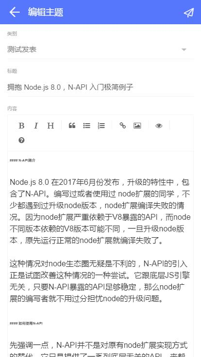

# vue-cnode

vue-cnode 是使用 Vue.js 开发的CNode 社区。[点击此预览](http://sufangyu.github.io/project/vue-cnode/index.html)
 
### 截图





### 功能

* 主题
  * 列表
  * 详情
    * 收藏
    * 分享
    * 发表评论
    * 点赞评论
  * 新建主题
  * 编辑主题
* 信息
  * 未读信息
  * 已读信息
* 个人中心
  * 最近回复
  * 最新发表
  * 我的收藏
  * 个人资料
* 账户
  * 登录
  * 退出

### 安装与使用

``` bash
# 安装依赖
npm install

# 开发
npm run dev

# 打包发布
npm run build

# 测试
npm test
```

For detailed explanation on how things work, checkout the [guide](http://vuejs-templates.github.io/webpack/) and [docs for vue-loader](http://vuejs.github.io/vue-loader).
